# Lesotho

This is my final project on Lesotho

## Administrative Subdivisions of Lesotho

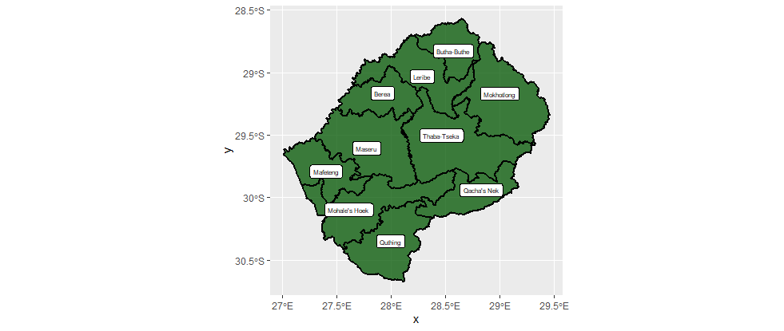

This graph depicts the adm1 level districts of Lesotho. The capital city is Maseru, which is also located within the state of Maseru.

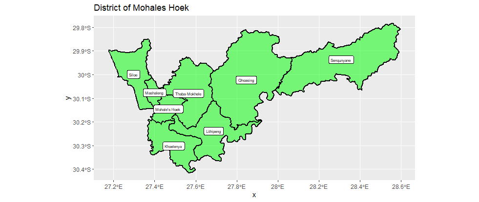 
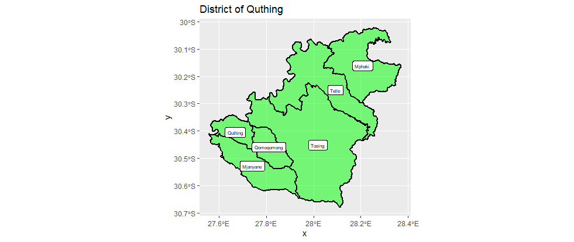

These graphs show the adm2 administrative subdivisions of the provinces of Hoek and Quthing. I noticed that unlike adm1 administrative subdivisions, the adm borders seem to have been designed to designate urban areas rather than reflect geographic barriers such as mountains and rivers.

## Administrative Subdivisions of Population

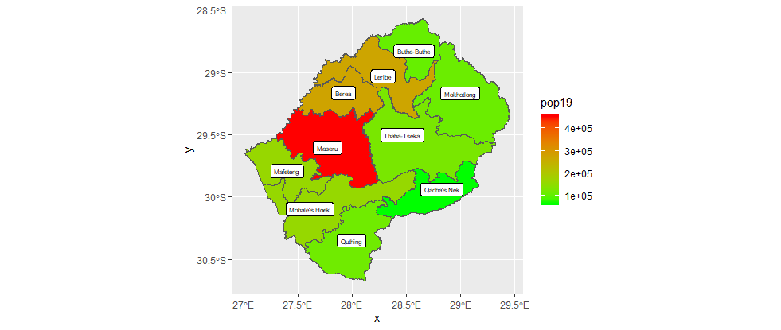

These graphs project my estimated total population for each adm1 layer district by projecting data obtained from a population raster onto simple feature plots. While population predictably decreased with distance from the capital, it was suprising to learn that larger states weren't any less likely to have more or less population than smaller ones. It was also noticeable that the western states in Lesotho contained significantly more population than the eastern states. 

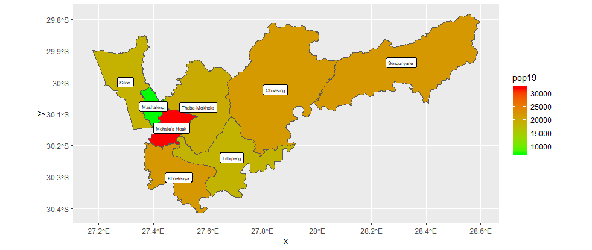
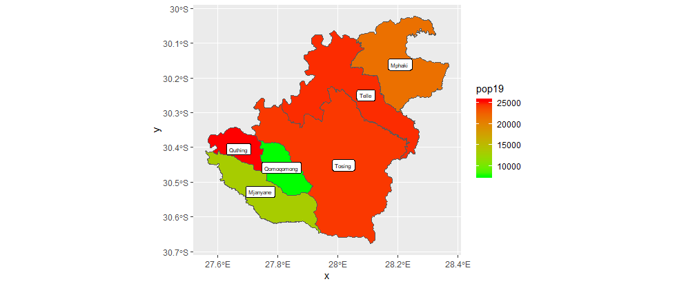

The adm2 population graphs indicated that urbanization is varied across different districts. Despite the 2 districts having roughly the same total population, Mohale's Hoek had 1 concentrated center of population while Quthing's population was spread out across the countryside.

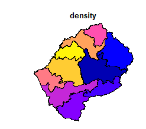

To further investigate the relationship between state size and population, I plotted population density over an adm1 layer simple features plot. However, the plot was very similar to population and didn't provide any new insights. This is likely because each state in Lesotho is roughly equal in size in terms of area.

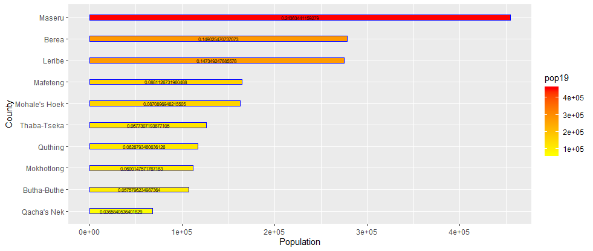

In addition to providing a simplified depiction of Lesotho's population distribution, the bar graph also shows how big each share of Lesotho's population by district. While my previous plots had shown that each western district had roughly the same population, the bar graph revealed that there still is a large gap between the capital district of Maseru and the other populated states. The bargraph shows that almost 1 in 4 people in the entire country are located in Maseru, making the country interesting in the sense that it's population is concentrated on a adm1 level, but in practice is actually still very spread out on the more precise adm2 level.

## Roadways and Access to Healthcare 

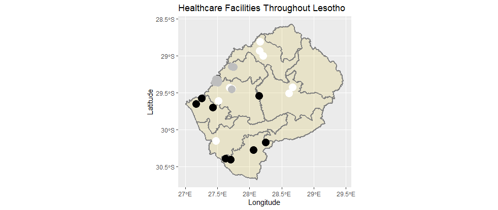
This graph depicts the total distribution of healthcare facilities in Lesotho, with the black points indicating fully fledged hospitals, the white points indicating smaller clinics, and the grey points indicating more specialized facilities such as pharmacies. There seems to be a disconnect between the location of large population centers and healthcare facilities, with the vast majority of hospitals being located in the south despite having roughly the same population as the north. It is also notable that the 2 northernmost states have no healthcare facilities whatsoever. 

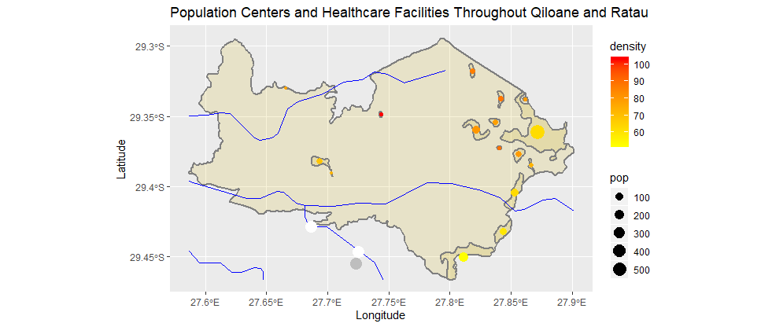
This graph of both healthcare facilities and roads of the provinces of Qiloane and Ratau. While there are healthcare facilities located on the road leading to the capital, it seems odd that the roads themselves do not connect to any of the major population centers. 

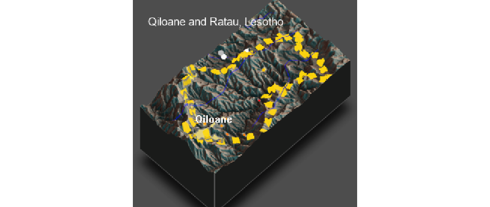
| District      | Population Density              | Cool  |
| ------------- |:-------------:| -----:|
| Maseru        |114
| Butha-Buthe   |60
| Leribe        |97
| Bera          |141
|Mafeteng       |76
|Mohale's Hoek  |44
|Quthing        |39
|Qacha's Nek    |32
|Mokhotlong     |27
|Thaba-Tseka    |26
